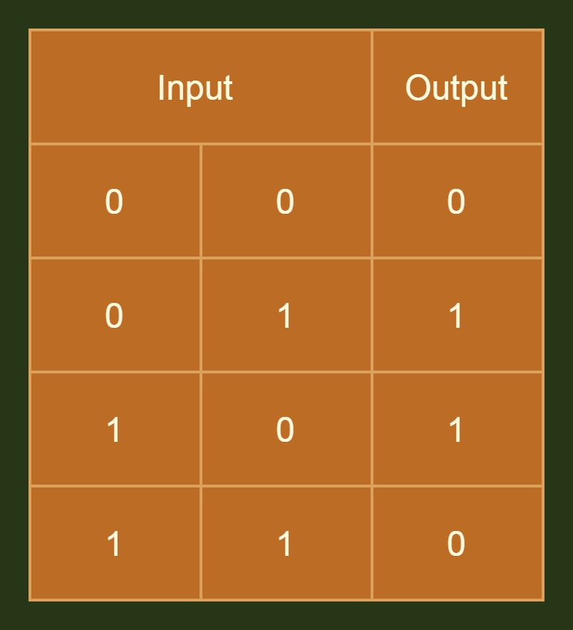
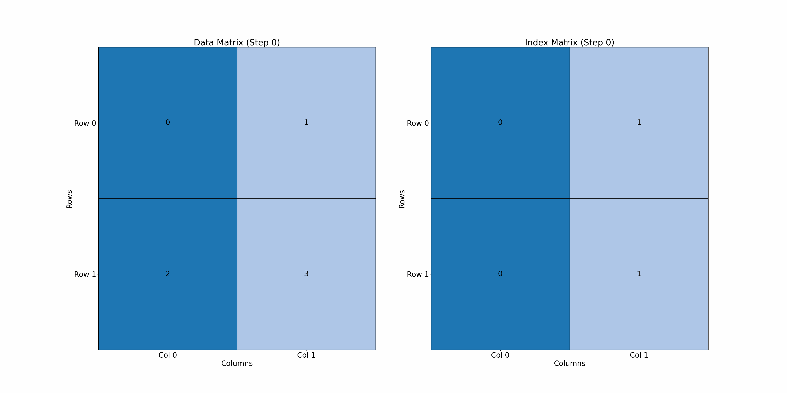
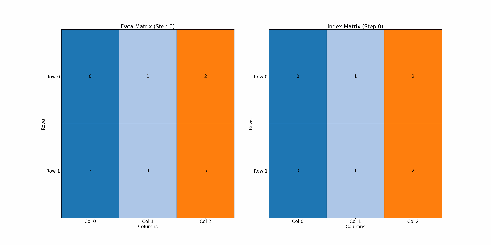
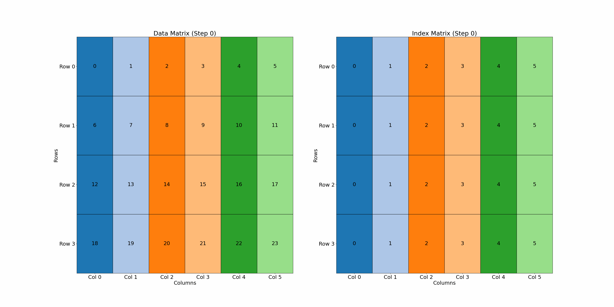
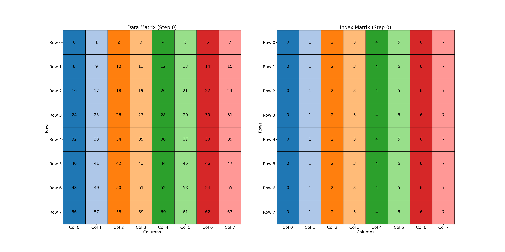
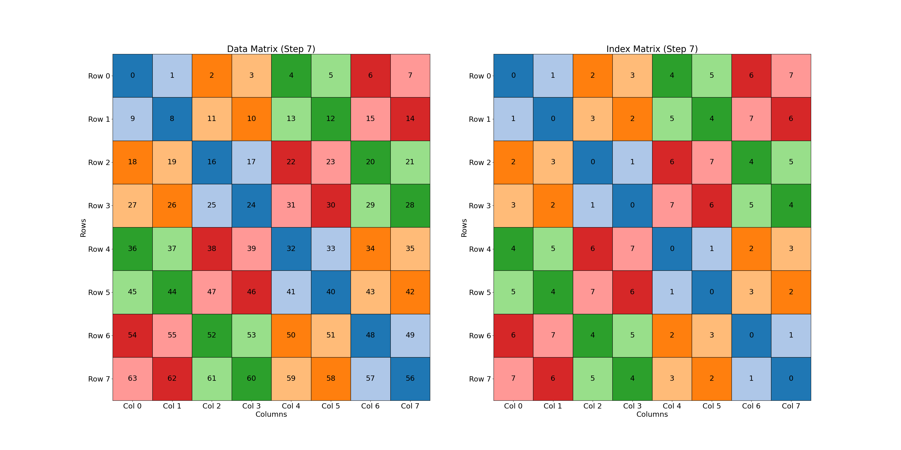
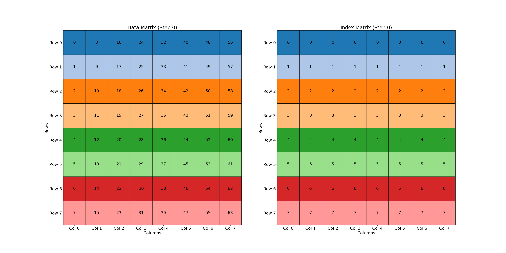
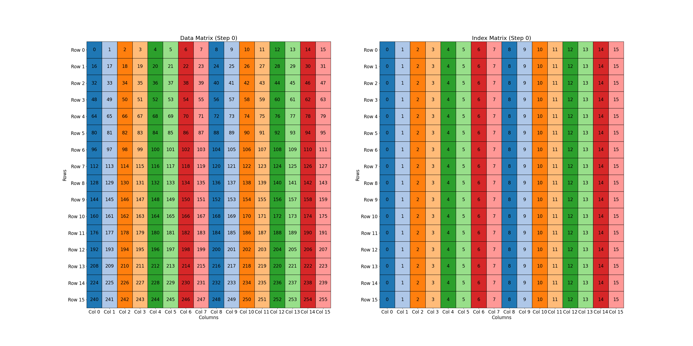


Swizzling from the ground up
Swizzling and how to reason about it
Applying Swizzling
Implementing Swizzling



#### This post assumes some knowledge of some GPU concepts (threads, warps, shared memory, memory banks). The code for this post can be found here on my [github](https://github.com/brod4910/mythical-cuda).

## Swizzling from the ground up
Swizzling is an operation that shuffles, permutes, or rearranges data in memory. In real compute devices, swizzling can reorganize memory to support certain algorithms (such as swapping or transposing) or to optimize memory access patterns. In this post, we will explore swizzling, particularly on GPU devices, where it’s commonly used. Though swizzling techniques also apply to CPUs (e.g., using AVX instructions for shuffling and permuting), we’ll reserve that discussion for another time.

For now, let’s build a foundational understanding of swizzling, using a simplified "toy GPU" with a maximum of 8 threads per cycle and 8 memory banks. This setup will help illustrate swizzling's impact and provide a basis for more complex, real-world algorithms and GPU architectures later in this post.

## Swizzling and how to reason about it
Firstly, the XOR operation is fundamental to swizzling. For a long time, XOR seemed intimidating to me since it often complicates problems, making solutions terse and harder to conceptualize. But let's break down XOR with a truth table:



The truth table tells us that for any two bits, A and B, if one (but not both) of A or B is 1, the result is 1. If both are 0 or both are 1, the result is 0. This exclusivity (A or B but not both) gives XOR its name: exclusive OR. How does XOR apply to swizzling? Let’s explore a simple example.

Take a 2x2 matrix as an example to familiarize yourself with the visualizations used throughout this post.

In the matrix on the left, data is numbered sequentially from 0 to (rows * columns) - 1. The right matrix, or "index matrix," represents where each element in the original matrix moves after the swizzle (using XOR).

The visualization shows each item swizzled row-by-row. Each cell’s color can be thought of as a “thread” accessing that matrix location.



Swizzling uses the inherent row and column structure of a matrix to shuffle elements in memory. In our 2x2 example, row 0 elements remain the same, while row 1 elements swap positions due to XOR, as shown below:

For row 0:
```
[0 ^ 0, 0 ^ 1] -> [0, 1]
```

For row 1:

```
[1 ^ 0, 1 ^ 1] -> [1, 0]
```

By XOR'ing row and column numbers, we determine how elements move according to the index matrix. Now, let’s move to a slightly larger 2x3 matrix.



In this case, swizzling causes an out-of-bounds memory access, indicated by `-1`. Let's work out why this happened by looking at the cell in question: `[1, 2]`.
```
C2 = 1 ^ 2 = 01 ^ 10 = 11 = 3 -> out-of-bounds
```

A rule of thumb to avoid these issues is ensuring matrix columns are powers of 2 or divisible by 4. Let’s examine a 4x6 matrix for clarity.



Out-of-bounds access occurs in the last two rows. Working through these by hand below shows why this is the case:

For row 2:

```
[2 ^ 0, 2 ^ 1, 2 ^ 2, 2 ^ 3, 2 ^ 4, 2 ^ 5] -> 
[(0010 ^ 0000), (0010 ^ 0001), (0010 ^ 0010), (0010 ^ 0011), (0010 ^ 0100), (0010 ^ 0101)] -> 
[2, 3, 0, 1, 6, 7]
```

For row 3:

```
[3 ^ 0, 3 ^ 1, 3 ^ 2, 3 ^ 3, 3 ^ 4, 3 ^ 5] ->
[(0011 ^ 0000), (0011 ^ 0001), (0011 ^ 0010), (0011 ^ 0011), (0011 ^ 0100), (0011 ^ 0101)] -> 
[3, 2, 1, 0, 7, 6]
```

By sticking to dimensions that are divisible by 4 or powers of 2, we ensure that the binarized indices align properly during the XOR operations. This alignment results in uniform access patterns and avoids the pitfalls associated with irregular dimensions. For the majority of this discussion, we will assume scenarios where the dimensions are powers of 2 but we will revisit how to handle matrices that do not fall into this category later.

##### Note: 

## Applying Swizzling
#### Quick Refresher on Bank Conflicts:
Bank conflicts occur when multiple GPU threads access data stored in the same memory bank. GPU memory banks hold 32-bit values, and on real devices, shared memory is divided into 32 banks. If two threads try to access the same bank address (different values in the same bank), the operation gets serialized, reducing throughput. If threads access the same address in a bank, the value is broadcast to all requesting threads, supporting up to 16 “multi-cast” requests in a single transaction.
Now that we’ve seen examples, let’s apply swizzling on our toy GPU (8 threads, 8 memory banks).

Suppose we need to transpose an 8x8 matrix. Typically, this requires four memory operations—two loads and two stores. First, values are read from main memory and written to shared memory in an ordered fashion. 

```
[0, 1, 2, 3] -> [0, 1, 2, 3]
```

In the next steps, values are accessed from shared memory and then stored in columns to main memory.

```
                  [0]
             <-   [1]
[0, 1, 2, 3]      [2]
             ->   [3]
```

This naive approach ignores GPU-specific memory constraints.

In our naive approach above, we're always going to get an unfavorable access pattern when we read/write to shared memory depending on if we read column-wise or row-wise. We'll go into more detail why that is below.

A few things to keep in mind when looking at the visualization:

1. Each cell's value in the index matrix indicates what collection of threads in a "cycle" accesses that element.
     - For example, `Row 0` is accessed in the first "cycle" denoted by `0`, then `1`, `2`, etc.
2. The colors follow the same rule and are a way to visualize what collection of threads accesses what value after swizzling.
3. If a column has repeated colors, we have a bank conflict
4. The data matrix reflects the colors from the index matrix visualize where the data ends up after swizzling.

With that in mind, below is our 8x8 matrix initially before any transformations.


Each row has favorable access patterns when we read since each row reads from a different bank. Now, if we wanted to transpose the elements in shared memory, we'd need to read the values in the columns shown below:



our column-wise loading would result in an 8-way bank conflict and the loads get serialized into individual transactions and be 1/8th the potential throughput! This is where swizzling comes into play. Let's look at what swizzling does to this matrix when we are loading from shared memory. Instead of a gif, I've added a carousel so it is easier to switch between images (click on the edges of either side to cycle through the images):


../assets/swizzle/8x8-steps/step_0.png
../assets/swizzle/8x8-steps/step_1.png
../assets/swizzle/8x8-steps/step_2.png
../assets/swizzle/8x8-steps/step_3.png
../assets/swizzle/8x8-steps/step_4.png
../assets/swizzle/8x8-steps/step_5.png
../assets/swizzle/8x8-steps/step_6.png
../assets/swizzle/8x8-steps/step_7.png



As we swizzle row by row, we see that the loads become favorable as we swizzle each row; reducing the number of bank-conflicts with each swizzle. Once we've reached our max swizzling, we have no bank-conflicts. Two things must happen for us to achieve proper swizzling.

1. We must swizzle when we store into shared memory
2. We must load from shared memory with the same swizzling

Swizzling when storing has no impact on performance since we're still storing to different banks. The time where it matters is when we have to load from shared memory. It is important to make the distinction here since swizzling has impacts on both stores/loads to shared memory.

## Implementing Swizzling
All of this conceptual knowledge has lead to this point. Let's write a kernel that implements the concepts we've learned on our toy GPU. We'll skip the initialization of memory, block sizing, etc. and get into just dissecting what a kernel would look like line-by-line (if you'd like to see the auxillary code, it'll be in the github link). One note here is that since our toy GPU has 8 threads, we'll be processing the whole 8x8 matrix with for loops, one per thread.

The first thing we need to do is create shared memory for our matrix and get our thread index.

```cuda
__shared__ uint32 shared_matrix[8][8];  // assuming 32-bit width type since banks hold 32-bits of information. Makes the example easier.

int threadIdx =  ... // Glossing over this since it isn't important for our case. Assume we have this information.
```

Once we have our rows and columns, we'll need to apply our trusty XOR operator to perform the first set of memory operations.

```cuda
// move row-by-row so a single thread processes one value in a row
for (int i = 0; i < 8; ++i) { 
     int linear_index = i * 8 + threadIdx;  // If we had a dynamic sized array, we'd replace 8 with the dimension of the column.

     int swizzle_x = i ^ threadIdx;  // calculate the swizzled index for x

     shared_matrix[i][swizzle_x] = matrix[linear_index];  // assigning value in matrix to shared matrix by swizzling
}
```

The code becomes a bit more complex but hopefully your mind envisioned our visualizations from earlier. Next, we need to then calculate the output indices since our matrix should look like this after we have swizzled to shared memory:



Notice how the values we want in the first row are on the diagonal and are in different banks since the number of banks is equal to the number of columns. Accessing the values we require is similar to storing them in that we need to use the swizzled index for each row. We'll need to read our matrix column-wise to ensure we don't get bank-conflicts when reading, then store row-wise to main memory.

Below is the kernel to perform this operation.

```cuda
for (int i = 0; i < 8; ++i) {
     int out_linear_idx = i * 8 + threadIdx; // If we had a dynamic sized array, we'd replace 8 with the dimension of the row.
     
     int swizzle_x = i ^ threadIdx;  // calculate the swizzled index for x

     transposed_matrix[out_linear_idx] = shared_matrix[i][swizzled_x];
}
```

The result of this loop should be a transposed matrix where all of the values in each row are stored in different banks:



At this point, we have sucessfully transposed an 8x8 matrix, however, this particular example is quite rudimentary since our matrix size is static and we have assumed it to always be an 8x8 matrix. Let's look at a 16x16 matrix.

## Swizzling For Larger Matricies
In an 8x8 matrix, we were able get away with processing the entire matrix in memory. Let's visualize what our 16x16 matrix:



One thing to keep in mind is that we are still operating under the assumption that we have only 8 threads in our toy GPU. Thus, we will chunk our matrix into 8x8 tiles to make the logic easier in our kernel. We'll be heavily relying on a small detail we glossed over in our initial kernel which was the `threadIdx`. It didn't make a whole lot of sense to dive deeper into this particular line for the 8x8 but let's go ahead and see what is typically involved in this calculation.

Typically, on a GPU device, we calculate a thread index by multiplying the block dimension by block index plus the thread index of the specific block.

```
int thread_idx = blockDim.x * blockIdx.x + threadIdx.x;
```

In our 16x16 case, we need to tile the matrix into 4 chunks and to make the problem easier, we'll launch our kernel using a grid of 2x2. This allows us to access our matrix easier but each tile will still be using 8 threads for it's computation. A pecuiliar thing to note about this grid is that we're launching a 2x2 block-sized grid with 1x8 sized blocks. This makes the kernel a bit weird in that we aren't directly using the block sizes to calculate the row or columns since we're using a for-loop. We'll modify our original kernel to get the proper starting points in the original matrix.


```cuda
// move row-by-row so a single thread processes one value in a row
for (int i = 0; i < 8; ++i) { 
     int linear_index = (i + (blockDim.y * blockIdx.y)) * 8 + (threadIdx + (blockDim.x * blockIdx.x));  // If we had a dynamic sized array, we'd replace 8 with the dimension of the column.

     int swizzle_x = i ^ threadIdx;  // calculate the swizzled index for x

     shared_matrix[i][swizzle_x] = matrix[linear_index];  // assigning value in matrix to shared matrix by swizzling
}
```

