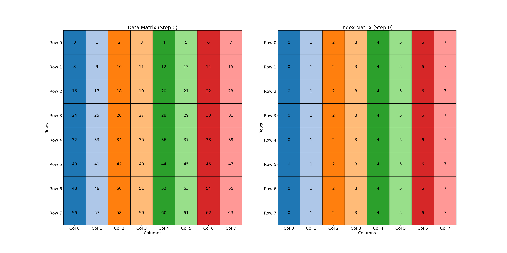
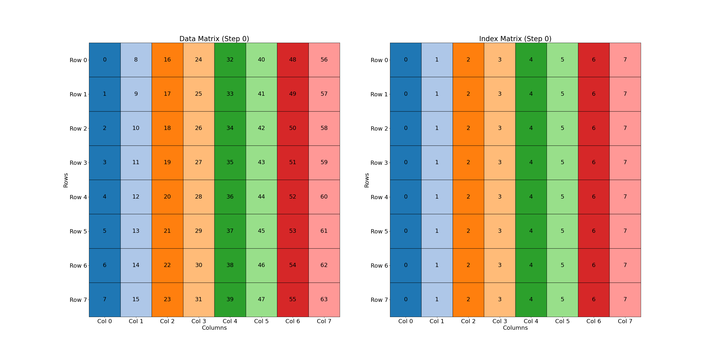


Swizzling from the ground up
Swizzling and how to reason about it
List



#### This post assumes some knowledge of some GPU concepts (threads, warps, shared memory, memory banks). Also, the code for this post can be found here: https://github.com/brod4910/mythical-cuda

## Swizzling from the ground up
Swizzling is an operation that shuffles, permutes, or rearranges data in memory. In real compute devices, swizzling can reorganize memory to support certain algorithms (such as swapping or transposing) or to optimize memory access patterns. In this post, we will explore swizzling, particularly on GPU devices, where it’s commonly used. Though swizzling techniques also apply to CPUs (e.g., using AVX instructions for shuffling and permuting), we’ll reserve that discussion for another time.

For now, let’s assume a foundational understanding of swizzling, using a simplified "toy GPU" with a maximum of 8 threads per cycle and 8 memory banks. This setup will help illustrate swizzling's impact and provide a basis for more complex, real-world algorithms and GPU architectures later in this post.

## Swizzling and how to reason about it
Firstly, the XOR operation is fundamental to swizzling. For a long time, XOR seemed intimidating to me since it often complicates problems, making solutions terse and harder to conceptualize. But let's break down XOR with a truth table:


The truth table tells us that for any two bits, A and B, if one (but not both) of A or B is 1, the result is 1. If both are 0 or both are 1, the result is 0. This exclusivity (A or B but not both) gives XOR its name: exclusive OR. How does XOR apply to swizzling? Let’s explore a simple example.

Take a 2x2 matrix as an example to familiarize yourself with the visualizations used throughout this post.

In the matrix on the left, data is numbered sequentially from 0 to (rows * columns) - 1. The right matrix, or "index matrix," represents where each element in the original matrix moves after the swizzle (using XOR).

The visualization shows each item swizzled row-by-row. Each cell’s color can be thought of as a “thread” accessing that matrix location.


Swizzling uses the inherent row and column structure of a matrix to shuffle elements in memory. In our 2x2 example, row 0 elements remain the same, while row 1 elements swap positions due to XOR, as shown below:

For row 0:
```
[0 ^ 0, 0 ^ 1] -> [0, 1]
```

For row 1:

```
[1 ^ 0, 1 ^ 1] -> [1, 0]
```

By XOR'ing row and column numbers, we determine how elements move according to the index matrix. Now, let’s move to a slightly larger 2x3 matrix.


In this case, swizzling causes an out-of-bounds memory access, indicated by -1. For instance, XOR'ing 1 and 2 gives:
```
C3 = 1 ^ 2 = 01 ^ 10 = 11 = 3 -> out-of-
```

One way to prevent such issues is ensuring matrix columns are powers of 2 or divisible by 4. This constraint relates to XOR behavior. Let’s examine a 4x6 matrix for clarity.


Out-of-bounds access occurs in the last two rows, as shown below:

For row 2:

```
[2 ^ 0, 2 ^ 1, 2 ^ 2, 2 ^ 3, 2 ^ 4, 2 ^ 5] -> 
[(0010 ^ 0000), (0010 ^ 0001), (0010 ^ 0010), (0010 ^ 0011), (0010 ^ 0100), (0010 ^ 0101)] -> 
[2, 3, 0, 1, 6, 7]
```

For row 3:

```
[3 ^ 0, 3 ^ 1, 3 ^ 2, 3 ^ 3, 3 ^ 4, 3 ^ 5] ->
[(0011 ^ 0000), (0011 ^ 0001), (0011 ^ 0010), (0011 ^ 0011), (0011 ^ 0100), (0011 ^ 0101)] -> 
[3, 2, 1, 0, 7, 6]
```

Out-of-bounds errors in non-power-of-2 dimensions occur because XOR spreads access patterns unevenly, so sticking to dimensions divisible by 4 (or powers of 2) avoids these pitfalls. We will assume the two scenarios of power of 2 or divisibilty by 4 for a majority of the post but we will revisit working with matrices that don't fall into this category later. MAYBE.

## Applying Swizzling
Now that we’ve seen examples, let’s apply swizzling to optimize GPU operations on our toy GPU (8 threads, 8 memory banks).

Suppose we need to transpose an 8x8 matrix. Typically, this requires four memory operations—two loads and two stores. First, values are read from main memory and written to shared memory in an ordered fashion (e.g., [0, 1, 2, 3] remains [0, 1, 2, 3]). In the next steps, values are accessed from shared memory and then stored in columns.

```
                  [0]
             <-   [1]
[0, 1, 2, 3]      [2]
             ->   [3]
```

This naive approach ignores GPU-specific memory constraints.

#### Quick Refresher on Bank Conflicts:
Bank conflicts occur when multiple GPU threads access data stored in the same memory bank. GPU memory banks hold 32-bit values, and on real devices, shared memory is divided into 32 banks. If two threads try to access the same bank address (different values in the same bank), the operation gets serialized, reducing throughput. If threads access the same address in a bank, the value is broadcast to all requesting threads, supporting up to 16 “multi-cast” requests in a single transaction.

The 8x8 matrix visualization below illustrates access patterns. 

1. Each cell's value indicates the accessing thread number
2. The colors follow the same rule and are a way to visualize what thread accesses what value after swizzling.
3. If a column has repeated colors, we have a bank conflict.

The data matrix reflects the colors from the index matrix to see where the data ends up after swizzling.

With that in mind, below is our 8x8 matrix initially before any transformations.



Each row has favorable access patterns when we read since each row reads from a different bank, however, when we write to shared memory, we see that the values and colors in our index matrix are the same reuslting in bank conflicts. If we were to transpose the matrix as is, shown below:



our writes would result in an 8-way bank conflict so the writes would get serialized into individual transactions and be 1/8th the potential throughput! This is where swizzling comes into play. Let's look at what swizzling does to this matrix. Instead of a gif, I've added a carousel so it is easier to switch between images:


../assets/swizzle/8x8-steps/step_0.png
../assets/swizzle/8x8-steps/step_1.png
../assets/swizzle/8x8-steps/step_2.png
../assets/swizzle/8x8-steps/step_3.png
../assets/swizzle/8x8-steps/step_4.png
../assets/swizzle/8x8-steps/step_5.png
../assets/swizzle/8x8-steps/step_6.png
../assets/swizzle/8x8-steps/step_7.png



As we swizzle row by row, we see that the accesses become favorable when writing to shared memory and accesses stay favorable for reading as well. The issue now is transposing becomes a bit more complex when writing the kernel but not by much as we'll see in a bit.

